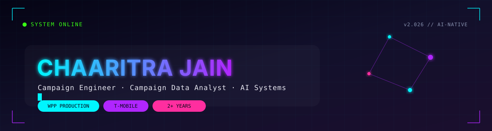

  

 

I'm a **Campaign Engineer & Campaign Data Analyst** at **WPP Production**, currently deployed on the **T-Mobile** account. I turn raw campaign data into audiences, dashboards and automated workflows — previously built on the Microsoft Power Platform, now applied to campaign engineering. Two years in, still compounding.

 

  

 

  

 

## Build Log

**🤖 Delayed Task Automation** — `Copilot Studio` `Power Automate`
Detects delayed tasks and auto-triggers rule-based workflows, cutting manual chasing to near zero.

**🎯 Campaign & Audience Analytics** — `SQL` `Python` `Power BI`
Extracts, validates and transforms campaign data into audiences that are actually targetable.

**🔗 SAP × Power Platform Integration** — `SAP` `Power Apps` `Power Automate`
Bridges SAP into the Power Platform, replacing repetitive manual ops with automated flow.

**⚽ Football Player Price Prediction** — `Python` `Machine Learning`
Predicts player market value from performance, age, position and transfer history.

 

## Credentials

**B.Tech, Computer Science** — Manipal University Jaipur · 2020–2024 · CGPA 8.20/10

Certified Data Analyst (IABAC) · Database Foundations (Oracle) · Intro to Networks (Cisco) · Cloud Foundations (AWS) · Business Intelligence (Udemy)

 

  

  <a href="YOUR_LINKEDIN_URL">LinkedIn</a> &nbsp;·&nbsp;
  <a href="mailto:chaaritrajain2101@gmail.com">Email</a> &nbsp;·&nbsp;
  <a href="YOUR_GITHUB_URL">GitHub</a>

